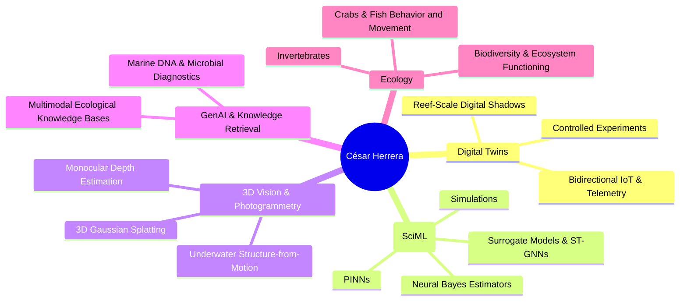

### Hi there, I'm César Herrera 👋

# César Herrera, Ph.D.  
### Marine Ecologist & Ecological AI Scientist

 

---

### 🌊 About Me & Research Vision

> *"My research focuses on understanding **how and why** biodiversity (**whom**) drives ecosystem functioning (**what**). From intertidal invertebrates to tropical coral reef matrices, I combine ecological theory with scientific machine learning, computer vision, AI and probabilistic modeling to understand nature and create the systems that allow us to protect it."*

At the **Australian Institute of Marine Science (AIMS)** my work focuses on bridging the gap between field observations, complex physical-ecological simulations, and real-time decision support.

Beyond core computational workflows, I have an enduring personal passion for the **ecology and behaviour of intertidal crabs**, **fish movement**, **metascience**, **scientific outreach**, and advancing the **public understanding of science**.

### 🔬 What I Work On

### 📬 Connect & Collaborate

- 🤝 **Collaborations:** Open to discussions on Scientific Machine Learning, ocean digital twins, underwater photogrammetry/computer vision, and AI for nature conservation.
